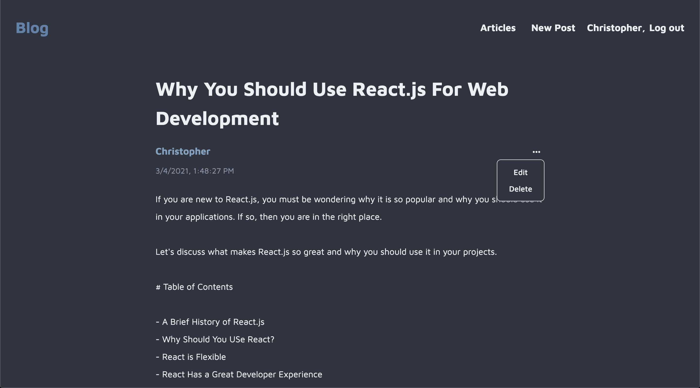
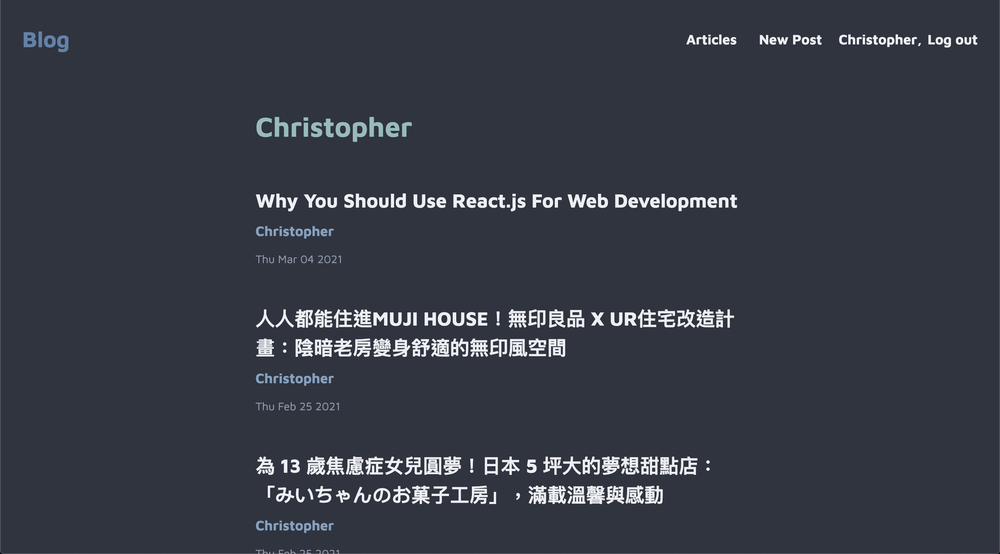
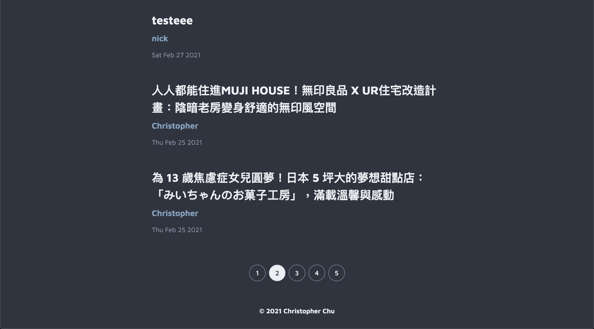
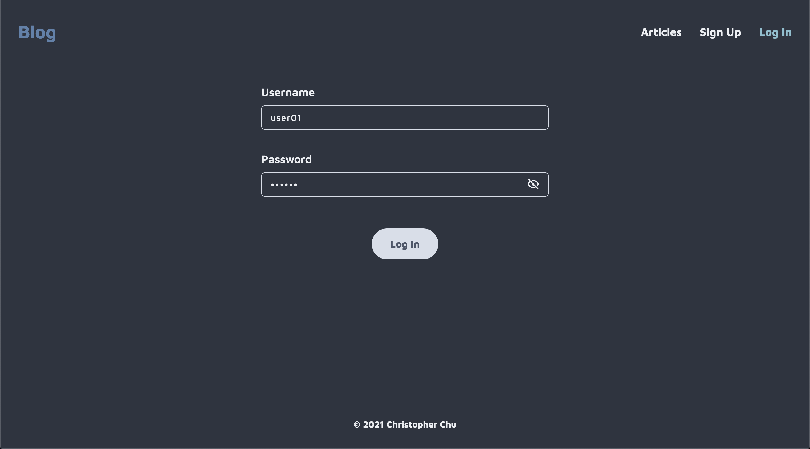

# Lidemy Students Blog

This is a project of [Lidemy Mentor Program](https://github.com/Lidemy/mentor-program-4th).

I build this single-page application with [Create React App](https://github.com/facebook/create-react-app) and [Lidemy 學生專用 API Server](https://github.com/Lidemy/lidemy-student-json-api-server).



You can edit and delete your own posts.



You can view the articles of a specific author by clicking on the author's name.



You can view the specific number of pages of all posts. And the best part is that when you reload the page, it stays on the same page.



Warning! Since the passwords of this system are stored in plain text format, they will be changed to `Lidemy` in the backend, so each user's password will be the same.

## Install

This project uses [node](http://nodejs.org) and [npm](https://npmjs.com). Go check them out if you don't have them locally installed.

```sh
npm install
```

## Usage

```sh
yarn start
```

Runs the app in the development mode.\
Open [http://localhost:3000](http://localhost:3000) to view it in the browser.

The page will reload if you make edits.\
You will also see any lint errors in the console.

```sh
yarn build
```

Builds the app for production to the `build` folder.\
It correctly bundles React in production mode and optimizes the build for the best performance.

The build is minified and the filenames include the hashes.\
Your app is ready to be deployed!

See the section about [deployment](https://facebook.github.io/create-react-app/docs/deployment) for more information.
